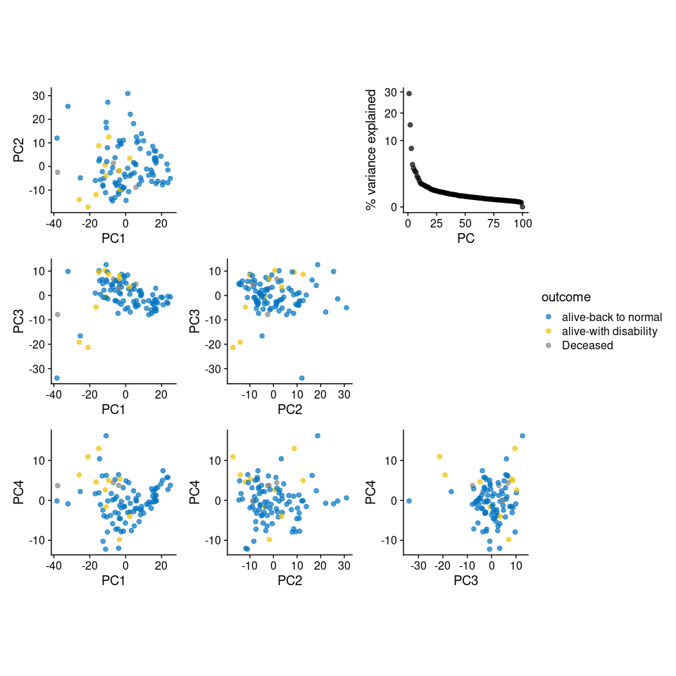
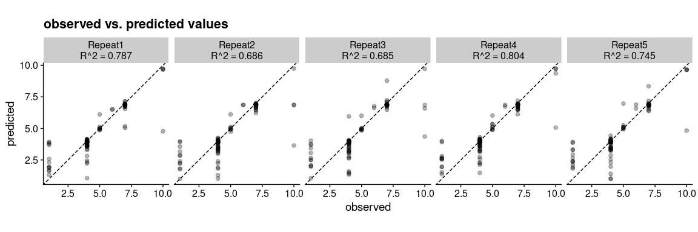
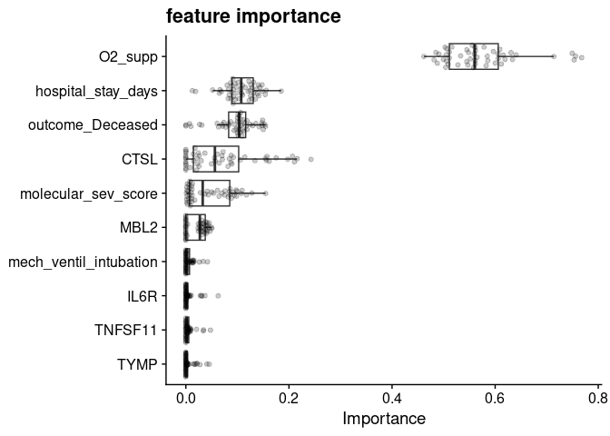
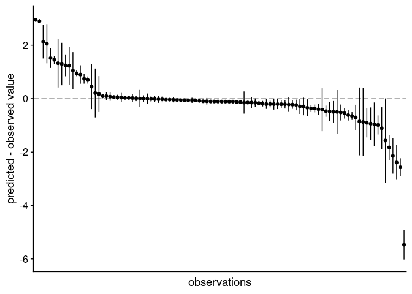
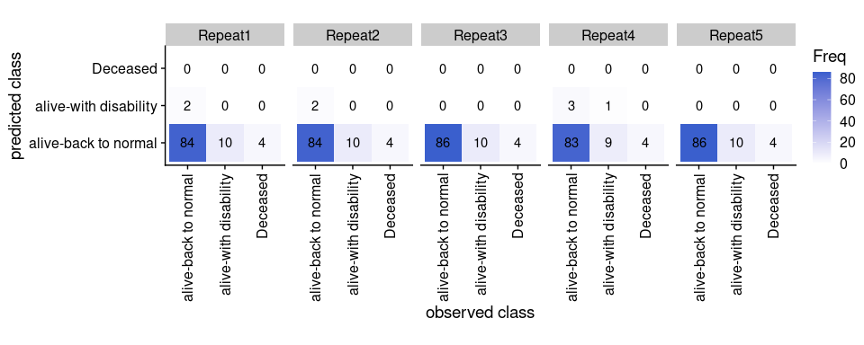
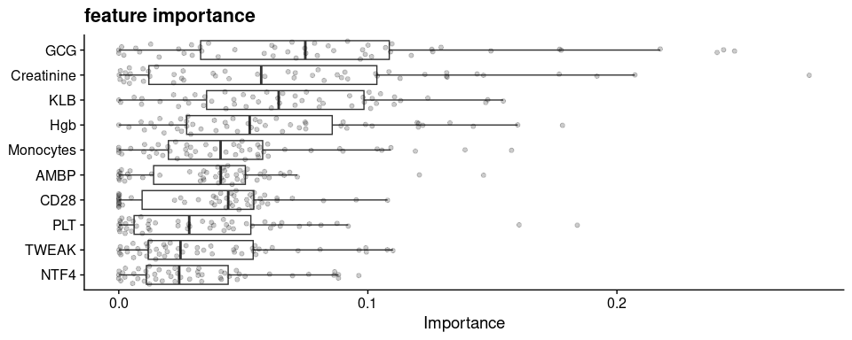

Predictive genomics using tidymodels and XGBoost
================
Frederik Ziebell
11/24/24

# Preparations

We start with loading all relevant data and packages.

``` r
library("parallelly")
library("future")
library("tidymodels")
library("vip")
library("RNAseqQC")
library("ggbeeswarm")
library("cowplot")
library("tidyverse")
theme_set(theme_cowplot())
```

# Load data

We use a dataset of 50 severe and 50 mild-moderate COVID-19 patients,
for which 893 plasma proteins were profiled along with clinical
covariates<sup>1</sup>. The data come in two parts. First, a proteins
$\times$ patients matrix of protein abundance measurements, which are
given by Olink normalized protein expression (NPX) values<sup>2</sup>.

``` r
assay <- readRDS("data/assay.rds")
dim(assay)
assay
```

    [1] 893 100

|           |  P066 |   P009 |   P085 |   P064 |   P026 |   P065 |   P098 |   P021 |   P011 |   P083 |
|:----------|------:|-------:|-------:|-------:|-------:|-------:|-------:|-------:|-------:|-------:|
| GSAP      |  1.60 |  0.926 |  1.719 |  0.914 |  1.672 |  0.705 |  0.920 |  0.788 |  0.921 |  0.708 |
| LILRA5    |  3.66 |  4.194 |  3.457 |  5.326 |  2.842 |  3.390 |  3.680 |  3.771 |  3.840 |  4.014 |
| NT-proBNP |  1.94 |  7.660 |  0.663 |  5.430 |  2.448 |  3.773 |  2.852 |  2.527 |  6.840 |  2.644 |
| SNAP23    |  3.97 |  0.587 |  2.376 |  0.502 |  2.183 |  0.561 |  0.157 |  0.597 |  0.610 |  0.855 |
| CCL24     |  3.16 |  5.735 |  4.480 |  3.748 |  3.154 |  4.701 |  3.009 |  4.490 |  4.550 |  5.480 |
| LGALS9    |  9.86 |  9.270 |  9.077 |  9.540 |  7.794 |  8.554 |  9.080 |  8.603 |  9.131 |  9.011 |
| STXBP3    | -0.04 | -0.146 | -0.652 | -0.540 | -0.544 | -0.476 | -0.689 | -0.614 | -0.563 | -0.242 |
| LGALS8    |  8.42 |  4.893 |  5.928 |  5.932 |  5.468 |  5.305 |  4.319 |  6.011 |  5.248 |  5.578 |
| TNFRSF10A |  3.69 |  4.741 |  3.908 |  4.260 |  3.748 |  2.856 |  3.822 |  3.116 |  5.196 |  4.007 |
| NFKBIE    |  2.30 |  1.426 |  1.302 |  2.054 |  1.032 |  1.455 |  1.000 |  1.113 |  1.531 |  1.032 |

Second, a `data.frame` of clinical covariates of the patients, such as
disease grading, oxygen saturation or co-morbidities. The rows in the
data frame are ordered to correspond to the columns of the assay matrix.

``` r
metadata <- readRDS("data/metadata.rds")
glimpse(metadata)
```

    Rows: 100
    Columns: 31
    $ Age                    <dbl> 42, 63, 59, 24, 48, 62, 47, 50, 61, 49, 56, 47, 48, 38, 55, 65, 61, 43, 35, 52, 31, 35, 31, 53, 35, 60, 35, 60, 23, 34, 34, 34, 41, 49, 46, 49, 44, 25, 45, 55, 56, 41, 59, 35, 43, 59, 51, 54, 53, 41, 60, 58, 52, 39, 33, 53, 40, 51, 29, 40, 35, 42, 35, 39, 51, 48, 28, 53, 59, 42, 40, 46, 42, 35, 26, 36, 35, 54, 26, 36, 46, 25, 25, 18, 53, 51, 40, 36, 22, 55, 25, 32, 18, 33, 43, 20, 61, 34, 53, 29
    $ Sex                    <chr> "M", "M", "M", "M", "M", "M", "M", "M", "M", "M", "M", "M", "M", "M", "M", "M", "F", "M", "M", "M", "M", "M", "M", "M", "M", "M", "M", "M", "M", "M", "M", "M", "M", "M", "M", "M", "M", "M", "M", "M", "M", "M", "M", "M", "M", "M", "M", "M", "M", "M", "M", "M", "M", "M", "M", "M", "M", "M", "M", "M", "M", "M", "M", "M", "M", "M", "M", "M", "F", "M", "F", "F", "M", "F", "M", "M", "M", "F", "F", "M", "M", "F", "F", "M", "M", "M", "M", "M", "M", "M", "M", "M", "M", "M", "M", "M", "M", "M", "M", "M"
    $ severity               <chr> "Severe", "Severe", "Severe", "Severe", "Severe", "Severe", "Severe", "Severe", "Severe", "Severe", "Severe", "Severe", "Severe", "Severe", "Severe", "Severe", "Severe", "Severe", "Severe", "Severe", "Severe", "Severe", "Severe", "Severe", "Severe", "Severe", "Severe", "Severe", "Severe", "Severe", "Severe", "Severe", "Severe", "Severe", "Severe", "Severe", "Severe", "Severe", "Severe", "Severe", "Severe", "Severe", "Severe", "Severe", "Severe", "Severe", "Severe", "Severe", "mild", "Severe", "mild", "mild", "mild", "mild", "Severe", "mild", "mild", "mild", "mild", "mild", "mild", "mild", "mild", "mild", "mild", "mild", "mild", "mild", "mild", "mild", "mild", "mild", "mild", "mild", "mild", "mild", "mild", "mild", "mild", "mild", "mild", "mild", "mild", "mild", "mild", "mild", "mild", "mild", "mild", "mild", "mild", "mild", "mild", "mild", "mild", "mild", "mild", "mild", "mild", "mild"
    $ molecular_sev_score    <dbl> 113.050, 111.210, 99.654, 95.654, 84.747, 81.601, 76.194, 75.280, 73.427, 71.258, 69.988, 65.531, 65.247, 61.761, 58.243, 57.219, 49.202, 47.734, 47.058, 46.670, 46.617, 44.599, 39.250, 38.571, 36.852, 36.426, 35.409, 35.368, 34.099, 31.458, 27.794, 27.451, 26.292, 26.253, 26.164, 25.695, 25.427, 24.460, 23.309, 22.269, 21.247, 20.924, 20.440, 17.157, 16.805, 16.429, 14.074, 13.691, 13.163, 12.805, 8.210, 6.718, 6.512, 5.970, 5.643, 4.950, 4.834, 4.225, 4.046, 4.030, 3.909, 3.784, 3.470, 3.263, 3.221, 3.218, 2.941, 2.705, 2.649, 2.587, 2.525, 2.506, 2.415, 2.381, 2.093, 1.977, 1.957, 1.822, 1.743, 1.722, 1.708, 1.652, 1.607, 1.578, 1.560, 1.436, 1.431, 1.415, 1.184, 1.171, 1.141, 1.127, 1.126, 0.988, 0.921, 0.869, 0.834, 0.736, 0.674, 0.352
    $ Grading                <dbl> 7, 7, 7, 10, 4, 7, 4, 7, 7, 7, 7, 4, 7, 4, 7, 7, 4, 4, 7, 7, 7, 4, 6, 7, 4, 7, 7, 10, 4, 4, 7, 7, 7, 7, 7, 7, 4, 6, 7, 10, 10, 7, 7, 7, 7, 7, 7, 7, 5, 4, 4, 4, 5, 5, 4, 4, 4, 5, 5, 5, 4, 5, 4, 4, 4, 4, 4, 4, 4, 5, 4, 1, 4, 4, 4, 4, 4, 4, 1, 4, 1, 1, 4, 1, 4, 4, 4, 1, 1, 4, 4, 1, 4, 1, 4, 1, 1, 4, 4, 1
    $ outcome                <chr> "alive-back to normal", "alive-with disability", "alive-back to normal", "Deceased", "alive-with disability", "alive-back to normal", "alive-with disability", "alive-back to normal", "alive-with disability", "alive-back to normal", "alive-back to normal", "alive-back to normal", "alive-back to normal", "alive-with disability", "alive-back to normal", "alive-with disability", "alive-back to normal", "alive-back to normal", "alive-back to normal", "alive-back to normal", "alive-with disability", "alive-back to normal", "alive-back to normal", "alive-back to normal", "alive-with disability", "alive-back to normal", "alive-back to normal", "Deceased", "alive-back to normal", "alive-back to normal", "alive-back to normal", "alive-back to normal", "alive-back to normal", "alive-back to normal", "alive-back to normal", "alive-back to normal", "alive-back to normal", "alive-back to normal", "alive-back to normal", "Deceased", "Deceased", "alive-back to normal"…
    $ Ethnicity              <chr> "Indian subcontinent", "MENA", "Others", "Indian subcontinent", "Others", "Indian subcontinent", "Indian subcontinent", "Indian subcontinent", "Indian subcontinent", "Indian subcontinent", "Indian subcontinent", "Indian subcontinent", "Indian subcontinent", "Indian subcontinent", "MENA", "MENA", "MENA", "Indian subcontinent", "Indian subcontinent", "Indian subcontinent", "Indian subcontinent", "Indian subcontinent", "Others", "MENA", "Indian subcontinent", "MENA", "Indian subcontinent", "Indian subcontinent", "Indian subcontinent", "Indian subcontinent", "Indian subcontinent", "Indian subcontinent", "Indian subcontinent", "MENA", "Indian subcontinent", "Others", "Others", "Indian subcontinent", "Indian subcontinent", "Indian subcontinent", "Others", "Others", "MENA", "Indian subcontinent", "Indian subcontinent", "Indian subcontinent", "Indian subcontinent", "MENA", "Indian subcontinent", "Indian subcontinent", "Indian subcontinent", "MENA", "Indian sub…
    $ BMI                    <dbl> 27.7, 47.3, 29.1, 20.8, 27.1, 27.7, 24.6, 22.0, 32.5, 24.4, 31.2, 25.7, 26.3, 28.4, 27.7, 22.6, 51.8, 27.3, 26.1, 26.7, 29.4, 31.1, 28.7, 33.1, 28.0, 26.9, 30.1, 26.1, 35.6, 26.6, 23.1, 26.5, 26.0, 41.0, 36.3, 32.6, 33.9, 26.6, 23.0, 25.9, 31.2, 33.9, 32.7, 28.6, 28.8, 27.2, 25.9, 35.7, 24.7, 33.2, 26.2, 27.7, 26.0, 21.0, 41.9, 28.4, 25.4, 25.5, 25.7, 29.4, 24.5, 27.5, 33.2, 24.0, 24.2, 27.9, 27.5, 27.8, 29.4, 26.7, 26.0, 22.4, 26.9, 33.8, 24.6, 22.9, 26.4, 21.9, 21.0, 31.5, 33.9, 22.8, 37.2, 22.9, 33.4, 32.4, 24.2, 22.6, 22.8, 28.9, 26.3, 26.5, 20.9, 24.7, 32.3, 23.4, 30.0, 21.1, 25.6, 22.0
    $ Obesity                <chr> "Overweight", "Obese", "Overweight", "Normal", "Overweight", "Overweight", "Normal", "Normal", "Obese", "Normal", "Obese", "Overweight", "Overweight", "Overweight", "Overweight", "Normal", "Obese", "Overweight", "Overweight", "Overweight", "Overweight", "Obese", "Overweight", "Obese", "Overweight", "Overweight", "Obese", "Overweight", "Obese", "Overweight", "Normal", "Overweight", "Overweight", "Obese", "Obese", "Obese", "Obese", "Overweight", "Normal", "Overweight", "Obese", "Obese", "Obese", "Overweight", "Overweight", "Overweight", "Overweight", "Obese", "Normal", "Obese", "Overweight", "Overweight", "Overweight", "Normal", "Obese", "Overweight", "Overweight", "Overweight", "Overweight", "Overweight", "Normal", "Overweight", "Obese", "Normal", "Normal", "Overweight", "Overweight", "Overweight", "Overweight", "Overweight", "Overweight", "Normal", "Overweight", "Obese", "Normal", "Normal", "Overweight", "Normal", "Normal", "Obese", "Obese", "Normal", …
    $ HeartRate              <dbl> 97, 82, 89, 131, 118, 100, 92, 101, 87, 106, 121, NA, 115, 119, 130, 94, 82, NA, 107, 115, 128, 79, 85, 130, 125, 78, 90, 103, 99, NA, 86, 116, 105, 103, 120, 117, 117, 121, 94, 117, 87, 77, 89, 88, 73, 100, 96, 88, 90, 99, 94, 80, 98, 94, 115, 113, 83, 106, 100, 99, 106, 107, 78, 110, 112, 104, 115, 90, 85, 112, 79, 78, 113, 81, 82, 98, 87, 82, 68, 118, 78, 70, 90, 111, 83, 79, 68, 78, 69, 91, 55, 78, 84, 84, 96, 78, 71, 124, 61, 82
    $ SPo2                   <dbl> 99, 96, 97, 98, 97, 97, 97, 94, 91, 98, 76, 98, 65, 97, 91, 96, NA, 98, 99, 91, 100, 99, 99, 95, 88, 94, 97, 98, 94, 97, 95, 94, 97, 94, 73, 96, 89, 82, 90, 95, 91, 96, 91, 96, 98, 99, 89, 92, 98, 96, 94, 98, 100, 98, 97, 96, 97, 98, 99, 96, 90, 96, 95, 98, 97, 99, 98, 97, 100, 99, 98, 100, 96, 99, 99, 96, 99, 100, 100, 95, 100, 100, 100, 100, 97, 97, 100, 100, 100, 99, 100, 100, 100, 100, 100, 99, 95, 99, 99, 100
    $ Smoker                 <chr> "yes", "no", NA, NA, NA, "no", "no", NA, "no", "no", NA, "no", NA, "no", NA, NA, "no", "no", "no", NA, NA, "no", "yes", "yes", NA, NA, "no", "no", "no", "yes", NA, NA, NA, "no", NA, "no", "no", NA, NA, NA, "yes", "no", "no", "no", NA, NA, "no", "no", "yes", "yes", "no", NA, "no", NA, "yes", "no", NA, "no", "no", "yes", NA, "no", NA, NA, NA, "no", "no", NA, "no", "no", "no", NA, "no", "yes", "no", "no", NA, "yes", "no", "no", "no", NA, "no", NA, "yes", "no", "no", NA, "no", "no", "no", NA, "no", "no", NA, NA, "yes", NA, "no", NA
    $ Diabetes               <dbl> 0, 1, 1, 0, 0, 1, 0, 1, 1, 1, 1, 0, 1, 0, 1, 0, 1, 0, 1, 0, 0, 0, 0, 0, 1, 1, 0, 1, 1, 0, 0, 0, 0, 1, 1, 0, 0, 0, 1, 1, 0, 0, 1, 1, 1, 1, 1, 1, 1, 0, 1, 0, 0, 0, 0, 0, 0, 0, 0, 0, 0, 1, 0, 0, 1, 0, 0, 1, 0, 0, 0, 0, 0, 0, 0, 0, 1, 0, 0, 0, 0, 0, 0, 0, 0, 0, 0, 0, 0, 0, 0, 0, 0, 0, 0, 0, 0, 0, 0, 0
    $ Hypertension           <dbl> 0, 1, 1, 0, 0, 1, 1, 1, 1, 0, 0, 0, 0, 0, 1, 0, 0, 0, 0, 1, 0, 0, 0, 0, 0, 1, 0, 1, 0, 0, 0, 0, 1, 1, 1, 1, 1, 0, 1, 0, 1, 0, 1, 1, 0, 1, 1, 1, 1, 1, 1, 0, 0, 0, 0, 0, 0, 0, 0, 1, 0, 0, 0, 0, 1, 1, 0, 0, 1, 0, 0, 1, 1, 0, 0, 0, 0, 1, 0, 0, 1, 0, 0, 0, 0, 0, 0, 0, 0, 0, 0, 0, 0, 0, 0, 0, 1, 0, 1, 0
    $ CAD                    <dbl> 0, 0, 0, 0, 0, 0, 0, 0, 0, 0, 0, 0, 0, 0, 1, 0, 0, 0, 0, 0, 0, 0, 0, 0, 0, 0, 0, 1, 0, 0, 0, 0, 0, 0, 1, 0, 0, 0, 0, 0, 0, 0, 0, 0, 0, 0, 0, 0, 0, 0, 0, 0, 0, 0, 0, 0, 0, 0, 0, 0, 0, 0, 0, 0, 0, 0, 0, 0, 0, 0, 0, 0, 0, 0, 0, 0, 0, 1, 0, 0, 0, 0, 0, 0, 0, 0, 0, 0, 0, 0, 0, 0, 0, 0, 0, 0, 0, 0, 0, 0
    $ RespRate               <dbl> 22, 22, 26, 25, 20, 26, 18, 46, 23, 16, 42, 14, 29, 20, 19, 17, 26, 18, 18, 27, 20, 18, 20, 22, 25, 26, 40, 20, 9, 20, 28, 30, 23, 28, 30, 29, 24, 28, 29, 38, 16, 30, 24, 20, 22, 15, 36, 24, 17, 26, 25, 18, 20, 20, 36, 22, 20, 18, 16, 17, 26, 19, 21, 18, 22, 18, 22, 17, 18, 18, 20, 18, 24, 19, 16, 18, 18, 17, 17, 18, 18, 17, 18, 18, 20, 18, 18, 17, NA, 20, 17, 19, 18, 18, 18, 18, 18, 20, 18, 18
    $ Admission_Diag         <chr> "Pneumonia & another organs", "Pneumonia and ARDS", "Pneumonia and ARDS", "Pneumonia and ARDS", "Pneumonia and ARDS", "Pneumonia and ARDS", "Pneumonia and ARDS", "Pneumonia and ARDS", "Pneumonia and ARDS", "Pneumonia and ARDS", "Pneumonia & another organs", "Pneumonia and ARDS", "Pneumonia and ARDS", "Pneumonia and ARDS", "Pneumonia & another organs", "Pneumonia and ARDS", "Pneumonia and ARDS", "Pneumonia and ARDS", "Pneumonia & another organs", "Pneumonia & another organs", "Pneumonia and ARDS", "Multiple", "Pneumonia & another organs", "Pneumonia & another organs", "Pneumonia and ARDS", "Pneumonia and ARDS", "Pneumonia & another organs", "Pneumonia and ARDS", "Pneumonia and ARDS", "Pneumonia and ARDS", "Pneumonia & another organs", "Pneumonia and ARDS", "Pneumonia and ARDS", "Pneumonia and ARDS", "Pneumonia and ARDS", "Pneumonia and ARDS", "Pneumonia and ARDS", "Pneumonia & another organs", "Pneumonia and ARDS", "Pneumonia and ARDS", "Pneumonia & ano…
    $ mech_ventil_intubation <dbl> 1, 0, 1, 1, 0, 1, 0, 1, 1, 1, 1, 0, 1, 0, 1, 1, 0, 0, 1, 1, 1, 0, 0, 1, 0, 1, 1, 0, 0, 0, 1, 1, 1, 0, 1, 1, 0, 0, 1, 1, 1, 1, 1, 1, 0, 1, 1, 1, 0, 0, 0, 0, 0, 0, 0, 0, 0, 0, 0, 0, 0, 0, 0, 0, 0, 0, 0, 0, 0, 0, 0, 0, 0, 0, 0, 0, 0, 0, 0, 0, 0, 0, 0, 0, 0, 0, 0, 0, 0, 0, 0, 0, 0, 0, 0, 0, 0, 0, 0, 0
    $ O2_supp                <dbl> 2, 1, 2, 2, 0, 2, 0, 2, 2, 2, 2, 0, 2, 0, 2, 2, 0, 0, 2, 2, 2, 0, 1, 2, 0, 2, 2, 0, 0, 0, 2, 2, 2, 1, 2, 2, 0, 1, 2, 2, 2, 2, 2, 2, 1, 2, 2, 2, 1, 0, 0, 0, 1, 1, 0, 0, 0, 1, 1, 1, 0, 1, 0, 0, 0, 0, 0, 0, 0, 1, 0, 0, 0, 0, 0, 0, 0, 0, 0, 0, 0, 0, 0, 0, 0, 0, 0, 0, 0, 0, 0, 0, 0, 0, 0, 0, 0, 0, 0, 0
    $ hospital_stay_days     <dbl> 20, 81, 39, 11, 43, 33, 40, 23, 82, 47, 28, 13, 13, 33, 36, 63, 49, 39, 40, 21, 26, 42, 41, 40, 30, 35, 16, 45, 25, 30, 18, 13, 25, 22, 32, 16, 23, 19, 38, 30, 23, 16, 19, 39, 31, 38, 15, 16, 36, 34, 16, 13, 36, 31, 26, 10, 28, 7, 15, 11, 44, 39, 5, 15, 12, 5, 1, 7, 7, 47, 25, 1, 32, 33, 31, 38, 3, 24, 4, 8, 4, 1, 5, 6, 6, 23, 27, 1, 3, 29, 12, 1, 4, 1, 4, 2, 0, 22, 7, 1
    $ Lymphocytes            <dbl> 1.40, 0.60, 1.00, 1.40, 1.00, NA, 1.30, 0.60, 2.00, 0.97, 1.70, NA, 1.50, NA, 0.80, 11.60, 0.70, 0.60, 0.90, 0.60, NA, 1.50, 28.40, 17.70, NA, 0.38, NA, 0.80, 0.70, 0.90, 1.00, 1.00, 0.00, 1.10, 1.00, 0.60, 2.20, 1.20, 0.60, 2.10, 1.10, 11.10, 0.60, NA, 1.80, 0.80, 0.60, 1.20, 12.10, 2.00, 1.20, 1.70, 1.10, 1.00, 1.40, 0.20, 1.30, 0.60, 21.30, 13.40, 23.20, 1.40, 0.80, 28.80, 1.00, 1.60, NA, 0.80, 1.80, 9.20, 0.80, 2.10, 1.60, 42.00, 2.20, 1.70, 0.80, 4.70, 0.90, 14.10, 2.30, 1.40, 31.90, 2.10, 1.80, NA, 3.20, 3.50, NA, 46.90, 3.00, 2.80, 1.60, 1.20, 1.20, 2.30, 2.00, 1.00, 1.50, 1.70
    $ Neutrophils            <dbl> 4.900, 4.300, 65.800, 8.000, 6.600, NA, 62.100, 8.600, 4.100, 76.500, 6.800, NA, 10.000, NA, 7.800, 76.900, 77.800, 0.823, 88.900, 3.200, NA, 78.200, 63.400, 6.400, NA, 93.000, NA, 10.000, 76.400, 0.861, 7.400, 6.600, 16.800, 4.100, 7.000, 7.500, 8.700, 85.900, 86.400, 9.100, 2.300, 8.300, 7.000, NA, 5.300, 9.700, 3.500, 2.300, 0.550, 7.600, 4.400, 4.600, 2.700, 2.400, 64.100, 95.100, 2.700, 4.900, 3.000, 7.400, 3.700, 6.600, 3.300, 61.100, 4.300, 3.800, NA, 2.000, 4.300, 12.000, 1.800, 4.600, 2.700, 3.590, 0.516, 7.800, 5.300, 5.400, 1.300, 76.600, 3.700, 3.000, 7.600, 3.000, 3.300, 1.800, 1.900, 3.400, NA, 1.600, 23.500, 4.900, 1.600, 4.300, 2.200, 2.500, 4.300, 5.600, 75.100, 4.100
    $ CRP                    <dbl> 108.0, 154.8, 67.8, 67.4, 46.6, 169.0, 12.0, 241.0, 63.0, 94.0, 111.5, 103.7, 338.0, NA, 295.4, 15.0, 116.4, 51.5, 235.6, 137.2, NA, 12.4, 111.0, 250.0, 116.1, 198.0, 205.0, 133.3, 9.8, 180.5, 47.6, 109.0, 245.1, 181.5, 71.9, 282.6, 113.7, 170.0, 83.9, 99.0, 107.4, 91.3, 170.0, NA, 125.4, 2.6, 109.2, 209.0, 33.0, 114.8, 99.1, 47.3, 16.7, 33.5, 26.7, 57.9, 26.0, 78.0, 51.0, 76.0, 123.6, 208.4, 64.0, NA, 157.8, 18.1, NA, 65.0, 23.1, 118.1, 14.4, 8.5, 65.0, NA, 2.4, 0.5, 14.0, 0.6, 0.3, 16.1, NA, 0.6, 8.0, 1.0, 5.0, 5.0, 0.8, 1.6, NA, 2.0, 0.3, 0.8, NA, 5.3, 1.5, NA, NA, 1.1, 11.4, 0.7
    $ Creatinine             <dbl> 0.93, 4.05, 1.04, 3.45, 0.98, 1.23, 1.21, 1.23, 2.30, 0.85, 1.19, 1.66, 1.33, NA, 1.19, 1.06, 0.78, 1.24, 0.64, 0.87, NA, 0.70, 1.06, 1.89, 1.32, 0.75, 0.84, 1.14, NA, 0.85, 1.02, 0.86, 1.10, 0.94, 0.79, 0.86, 1.23, 1.46, 1.06, 0.96, 1.00, 0.71, 0.85, NA, 0.55, 0.88, 0.87, 1.04, 13.30, 1.01, 1.11, 0.81, 1.11, 1.02, 1.01, 1.03, 0.66, 0.79, 1.02, 0.83, 1.18, 0.86, 0.96, 0.86, 1.14, 0.97, NA, 1.01, 0.74, 0.97, 0.63, 0.85, 0.85, 0.87, 0.97, 0.95, 0.80, 0.57, NA, 1.02, 0.72, 0.74, 0.89, 0.94, 0.78, 0.86, 0.96, 0.79, 0.88, 1.00, 1.12, 0.81, 0.90, 0.89, 0.97, 0.64, 1.09, 0.92, 0.85, 0.88
    $ WBC                    <dbl> 6.7, 5.1, 3.7, 10.0, 8.4, 7.1, 5.2, 9.9, 6.6, 5.2, 8.9, 6.3, 11.9, NA, 9.0, 11.4, 6.0, 5.4, 12.2, 3.9, NA, 11.1, 5.1, 8.7, 5.7, 14.8, 11.8, 11.5, 5.1, 10.9, 9.2, 8.3, 18.3, 5.3, 8.9, 8.7, 11.3, 11.6, 7.0, 6.5, 3.7, 9.9, 7.8, NA, 7.7, 11.7, 4.5, 3.8, 9.7, 10.4, 5.7, 7.2, 4.4, 3.6, 5.2, 6.5, 4.9, 6.0, 4.5, 9.4, 5.7, 8.1, 4.4, 4.8, 7.1, 6.2, NA, 3.1, 6.9, NA, 3.0, 7.3, 4.8, 7.0, 5.5, 10.4, 6.5, 11.0, 2.8, 8.1, 6.6, 4.7, NA, 5.8, 5.8, 4.3, 5.9, 7.8, 4.4, 4.3, 4.6, 8.3, 3.8, 6.2, 4.0, 5.9, 6.9, 7.3, 10.8, 6.4
    $ Eosinophils            <dbl> 0.00, 0.00, 0.00, NA, 0.00, NA, 0.00, 0.00, 0.00, 0.00, 0.00, 0.00, 0.00, NA, 0.10, 0.40, 0.00, 0.00, 0.00, 0.00, NA, 0.10, 0.00, 0.00, NA, 0.00, NA, 0.00, 0.00, 0.00, 0.20, 0.00, 0.00, 0.00, 0.00, 0.00, 0.00, 0.00, 0.00, 0.00, 0.10, 0.00, 0.00, NA, 0.00, 0.50, 0.00, 0.00, 0.70, 0.00, 0.10, 0.20, 0.00, 0.00, 0.00, 0.00, 0.40, 0.00, 0.00, 0.10, 0.20, 0.00, 0.00, 0.60, 0.00, 0.00, NA, 0.00, 0.20, 0.00, 0.00, 0.00, 0.00, 0.06, 0.10, 0.20, 0.00, 0.10, 0.00, 0.00, 0.20, 0.02, 0.20, 0.10, 0.00, 0.10, 0.20, 0.30, NA, 1.60, 0.20, 0.10, 0.10, 0.00, 0.00, 0.50, 0.10, 0.00, 0.00, 0.00
    $ Glucose                <dbl> 10.8, 10.3, 7.8, 3.2, 7.6, 6.7, NA, 16.2, 11.4, 8.7, 10.8, NA, 14.4, NA, 16.0, 7.3, 9.9, 7.6, 11.7, 11.5, NA, 7.4, 6.7, 6.1, 8.5, 18.8, 12.6, 15.2, 8.0, NA, 4.8, 4.3, NA, 10.1, 10.6, 6.8, 4.8, 5.2, 6.0, 6.9, 7.2, 7.8, 9.9, NA, 17.8, 12.7, 13.6, 9.8, 7.5, 5.4, 15.2, 6.1, 7.1, 5.5, NA, 11.4, 4.9, 6.2, 6.9, 5.7, 5.7, 19.0, 5.7, 8.6, 8.2, 7.2, NA, 8.9, 6.1, NA, 5.9, 5.7, 5.2, NA, 7.8, 5.6, 9.9, 5.2, 4.7, NA, 5.8, 7.0, 4.6, 4.0, NA, NA, NA, 5.9, 5.0, 4.7, 4.1, 6.1, 4.5, 5.5, 6.2, NA, 6.6, 5.1, 4.9, 6.2
    $ Hgb                    <dbl> 14.7, 9.4, 14.5, 13.9, 15.1, 12.5, 16.5, 13.5, 15.7, 12.9, 13.0, 15.6, 13.9, NA, 15.1, 15.4, 12.0, 14.9, 12.7, 11.7, NA, 14.9, 16.2, 11.4, 12.4, 15.6, 12.8, 13.3, 15.1, 15.1, 14.2, 14.8, 16.0, 14.2, 11.7, 12.5, 11.7, 10.0, 13.5, 15.7, 16.9, 13.5, 13.7, NA, 16.5, 4.4, 13.3, 13.4, 9.9, 13.8, 12.6, 13.9, 13.6, 15.5, 15.3, 13.0, 14.2, 15.3, 13.5, 13.3, 11.9, 12.1, 15.6, 14.9, 9.7, 13.7, NA, 15.0, 12.2, 14.5, 9.6, 14.4, 14.2, 10.5, 15.8, 14.7, 15.9, 13.8, 9.7, 17.1, 16.2, 14.8, 13.4, 15.3, 14.8, 14.8, 14.2, 13.5, 15.2, 15.4, 5.3, 14.9, 14.9, 16.9, 16.4, 15.1, 15.0, 15.1, 14.1, 15.2
    $ PLT                    <dbl> 203, 245, 166, NA, 183, 194, 139, 202, 130, 152, 177, 176, 400, NA, 173, 168, 222, 148, 284, 196, NA, 322, 138, 247, 175, 230, 193, 286, 175, 2, 263, 239, 244, NA, 226, 252, 263, 276, 269, 238, 116, 289, 181, NA, 194, 254, 207, 106, 175, 207, 263, 220, 130, 225, 211, 165, 345, 233, 147, 200, 304, 156, 168, 153, 309, 255, NA, 133, 310, 273, 156, 252, 189, 345, 190, 244, 0, 199, 287, 186, 256, 294, 450, 225, 253, 248, 171, 202, 278, 240, 245, 324, 287, 187, 202, 210, 231, 208, 372, 288
    $ Monocytes              <dbl> 0.50, 0.20, 0.30, 0.40, 0.80, NA, 0.60, 0.70, 0.30, 4.80, 0.40, NA, 0.30, NA, 0.30, 10.70, 0.60, 0.30, 3.80, 0.20, NA, 0.80, 8.00, 0.70, NA, 4.30, NA, 0.70, 9.60, 0.60, 0.60, 0.60, 0.60, 0.10, 0.70, 0.50, 0.40, 3.30, 0.40, 0.50, 0.40, 0.60, 0.20, NA, 0.50, 0.70, 0.30, 0.20, 0.45, 0.70, 0.70, 0.80, 0.60, 0.20, 0.50, 0.10, 0.40, 0.50, 0.50, 6.80, 0.70, 0.40, 0.30, 9.10, 1.00, 0.80, NA, 0.30, 0.60, 0.40, 0.40, 0.50, 0.50, 5.20, 0.40, 0.70, 5.70, 0.80, 0.50, 0.70, 0.40, 0.20, 5.80, 0.60, 0.60, 0.30, 0.50, 0.50, NA, 12.20, 0.30, 0.50, 0.50, 0.60, 0.60, 0.60, 0.40, 0.60, 10.20, 0.50
    $ Urea                   <dbl> 4.20, 30.00, 4.00, 8.70, 2.20, 4.40, 4.10, 4.80, 11.68, 4.06, 10.30, 8.60, 7.70, NA, 6.90, 4.90, 3.20, 5.50, 3.20, 4.10, 2.00, 3.80, 4.69, 8.30, 4.20, 8.88, 3.15, 6.20, NA, 2.50, 4.00, 2.00, 4.30, 3.50, 2.50, 4.20, 5.40, 3.60, 4.00, 4.20, 2.90, 3.80, 5.50, 4.10, 6.30, 4.10, 3.30, 3.20, 15.44, 4.00, 3.10, 4.00, 3.60, 5.40, 4.00, 3.00, 2.30, 3.43, 3.10, 4.40, 6.50, 5.10, 4.50, 3.00, 3.00, 4.10, NA, 5.60, 7.60, 2.70, 3.60, 2.20, 2.60, 4.80, 5.10, 7.00, 2.50, 8.30, 1.50, 3.50, 4.30, 5.10, 6.60, 4.60, 5.10, 2.20, 5.90, 2.80, 3.30, 4.00, 5.40, 4.50, 3.50, 3.50, 5.00, 2.70, 5.90, 4.50, 3.00, 3.30

# Explore data

Before we start with predicting an outcome, it is always advisable to
look at the data. To get a first rough idea for the data, we only create
a scatter matrix of PCA plots and plot it by one outcome of interest
(incidentally called *outcome*). For a thorough analysis, a more
detailed exploratory analysis step would be needed.

``` r
plot_pca_scatters(assay, metadata = metadata, color_by="outcome", n_PCs = 4)
```



# Combine data objects

As a first example, we try to predict the disease grading. Although the
original publication does not mention how the grading score is computed,
it seems to refer to the Ordinal Scale for Clinical Improvement as
published in the WHO COVID-19 Therapeutic Trial Synopsis<sup>3</sup>.
There, disease grading is a score from 0 (uninfected) to 8 (dead) based
the level of required oxygen and renal support.

We combine all potential predictors, i.e. the the assay matrix and
metadata, into a `data.frame` where each column is a variable and each
row is an observation (patient). Finally, we add a column `y`, which
contains our outcome of interest.

``` r
predictors_meta <- metadata[,!names(metadata) %in% "Grading"]

data <- data.frame(t(assay)) %>%
  cbind(predictors_meta) %>%
  cbind(y = metadata$Grading)
```

# Train model

Training a model works in several steps. First, we prepare the input
data for the model by defining a *recipe* which specifies the outcome
and predictors in the data set. We also specify to dummy code nominal
predictors.

``` r
rec <- recipe(y ~ ., data) %>% 
  step_unknown(all_nominal_predictors()) %>% 
  step_dummy(all_nominal_predictors())
```

Next, we define the model to use for prediction, in this case a
regression model by means of the XGBoost library. XGBoost has a number
of hyperparameters such as the learning rate or tree depth, which
influence model performance. We will infer these parameters by assessing
model performance for different parameter combinations and finally
choose the model with maximum performance.

``` r
# define model
model <- boost_tree(
  mode = "regression", 
  engine = "xgboost",
  trees = tune(),
  min_n = tune(),
  tree_depth = tune(),
  learn_rate = tune(),
  loss_reduction = tune()
)

# define tuning parameters
params <- parameters(
  trees(),
  min_n(),
  tree_depth(),
  learn_rate(),
  loss_reduction()
)
```

The defined recipe and model are combined in a workflow, which is then
run on a set of hyperparameter combinations to infer the best model. For
this, we define a grid of 100 points in parameter space at which model
performance is assessed. Performance is measured as out of sample
prediction accuracy during cross validation. Parameter tuning takes a
long time, about 40min on an Intel Core i7-10510U CPU. If you want to
reproduce this workflow and don’t want to wait that long, you can
uncomment the last line in the following code block.

``` r
# modeling workflow
wf <- workflow() %>% 
  add_recipe(rec) %>% 
  add_model(model)

# set up grid search for tuning parameters
set.seed(1)
grid <- grid_space_filling(params, size = 100)

# set up cross validation
set.seed(2)
folds <- vfold_cv(data, v = 10)

# parallel processing
n_workers <- max(1, length(availableWorkers())-1)
plan("multisession", workers = n_workers)

# tune parameters
model_res <- tune_grid(
  object = wf,
  resamples = folds,
  grid = grid,
  metrics = metric_set(rmse),
  control = control_grid(
    verbose = F,
    parallel_over = "everything",
    save_pred = T
  )
)
# model_res <- readRDS("data/model_res_regression.rds")
```

After tuning is completed, we have a look at the top 5 best performing
models and select the best one for a final round of fitting.

``` r
# best models
show_best(model_res, metric = "rmse")
best_params <- select_best(model_res)
```

| trees | min_n | tree_depth | learn_rate | loss_reduction | .metric | .estimator |  mean |   n | std_err | .config                |
|------:|------:|-----------:|-----------:|---------------:|:--------|:-----------|------:|----:|--------:|:-----------------------|
|  1475 |     2 |          8 |      0.003 |            0.0 | rmse    | standard   | 0.876 |  10 |   0.158 | Preprocessor1_Model002 |
|   929 |     8 |          4 |      0.081 |            0.0 | rmse    | standard   | 1.151 |  10 |   0.125 | Preprocessor1_Model020 |
|  1293 |    21 |          1 |      0.004 |            0.0 | rmse    | standard   | 1.183 |  10 |   0.137 | Preprocessor1_Model058 |
|  1232 |    15 |          7 |      0.019 |           10.8 | rmse    | standard   | 1.208 |  10 |   0.145 | Preprocessor1_Model040 |
|  1010 |    23 |          3 |      0.005 |            0.0 | rmse    | standard   | 1.214 |  10 |   0.120 | Preprocessor1_Model066 |

# Finalize model

To get a thorough understanding of the selected model, we repeat the
10-fold cross validation for 5 times, leading to 5 predictions of each
data point. During this process, we also extract variable importance
using the vip package. Variable importance is computed for each fold of
each repeat, leading to 50 importance values per variable.

``` r
model_final <- finalize_model(model, best_params)

set.seed(3)
folds_repeated <- vfold_cv(data, v = 10, repeats = 5)

final_fit <- wf %>%
  update_model(model_final) %>%
  fit_resamples(
    folds_repeated,
    control = control_resamples(
      extract = vip::vi,
      parallel_over = "everything",
      save_pred = TRUE
    )
  )
```

# Assess final model

We will make several plots to understand the final model. First, let’s
visualize the goodness of fit by plotting observed versus predicted
values for each observation of the response. Since we did repeated cross
cross validation, we can make this plot for each of the repeats. In our
case, predicting disease grading gave mediocre results, with
$R¹2\approx 0.75$.

``` r
# R^2 per repeat
r2 <- final_fit %>% 
  select(id, .predictions) %>% 
  unnest(.predictions) %>% 
  group_by(id) %>% 
  summarize(r2 = 1-sum((y-.pred)^2)/sum((y-mean(y))^2))

facet_labs <- imap_chr(r2$r2, ~str_c("Repeat",.y,"\nR^2 = ",round(.x,3))) %>% 
  `names<-`(str_c("Repeat",seq_along(r2$r2)))

# observed vs. predicted response
final_fit %>% 
  select(id, .predictions) %>% 
  unnest(.predictions) %>% 
  left_join(r2, by="id") %>% 
  ggplot(aes(y, .pred)) +
    geom_point(alpha = .3, size = rel(2)) +
    geom_abline(linetype = "42") +
    coord_fixed() +
    facet_wrap(~id, labeller = as_labeller(facet_labs), nrow = 1) +  
    labs(
      x = "observed", y = "predicted",
      title = "observed vs. predicted values"
    )
```



Second, we can show which features were the most important for the
prediction. Unsurprisingly, $\text{O}_2$ supplementation was the most
important variable in our case study, as the amount of oxygen supply is
the major factor based on which disease grading is carried
out<sup>3</sup>. Interestingly, the most important gene to predict the
disease grade is CTSL, which cleaves the S1 subunit of the SARS-CoV-2
spike protein and is essential for virus entry into the
cell<sup>4</sup>.

``` r
# feature importance
n_top <- 10
final_fit %>% 
  select(id, id2, .extracts) %>% 
  unnest(.extracts) %>% 
  unnest(.extracts) %>%
  complete(id, id2, nesting(Variable), fill=list(Importance=0)) %>% 
  group_by(Variable) %>% 
  mutate(mean_importance = mean(Importance)) %>% 
  ungroup() %>% 
  arrange(-mean_importance) %>% 
  mutate(Variable = fct_inorder(factor(Variable))) %>%
  filter(as.integer(Variable) <= n_top) %>% 
  ggplot(aes(Variable, Importance)) +
    geom_boxplot(outlier.shape = NA) +
    ggbeeswarm::geom_quasirandom(alpha = .2) +
    labs(x = NULL, title = "feature importance") +
    coord_flip() +
    scale_x_discrete(limits = rev)
```



Third, we can ask which observations are harder to predict than others.
This can be done by plotting the residuals of each observation. Note
that there is more than one residual per observation, owing to the
repeated cross validation.

``` r
# residuals per observation
bind_rows(final_fit$.predictions) %>%
  mutate(obs_name = rownames(data)[.row]) %>%
  mutate(resid = .pred - y) %>%
  group_by(.row) %>%
  mutate(mean_resid=mean(resid)) %>% 
  ungroup() %>% 
  arrange(-mean_resid) %>% 
  mutate(obs_name = fct_inorder(factor(obs_name))) %>% 
  ggplot(aes(obs_name, resid)) +
    geom_hline(yintercept = 0, color = "gray62", linetype = "63") +
    stat_summary(
      geom = "linerange",
      fun.data = mean_sdl, 
      fun.args = list(mult = 1)
    ) +
    stat_summary(
      geom = "point", 
      fun = mean
    ) +
    labs(x = "observations", y = "predicted - observed value") +
    theme(axis.text.x = element_blank(),
          axis.ticks.x = element_blank())
```



# Predict overall outcome

XGBoost cannot only be used for regression tasks, i.e. predicting a
numeric response, but also for classification, i.e. predicting a
categorical response. To showcase this task, we choose to predict the
*outcome* of each patient, which denotes whether the patient survived
with or without disability, or died.

``` r
table(metadata$outcome)
```

| alive-back to normal | alive-with disability | Deceased |
|---------------------:|----------------------:|---------:|
|                   86 |                    10 |        4 |

The process for classification follows almost exactly the same steps as
the one for regression. We only have to define the mode *classification*
in the `boost_tree()` specification and show a confusion matrix to
compare observed and predicted class labels. As can be seen, the model
poorly predicts the outcome. The reason for this could be that the
classes are highly imbalanced classes but it is also possible that the
outcome can fundamentally not be predicted from the genomic readout and
clinical covariates.

``` r
predictors_meta <- metadata[,!names(metadata) %in% "outcome"]

data <- data.frame(t(assay)) %>%
  cbind(predictors_meta) %>%
  cbind(y = metadata$outcome)

rec <- recipe(y ~ ., data) %>% 
  step_unknown(all_nominal_predictors()) %>% 
  step_dummy(all_nominal_predictors())

# define model
model <- boost_tree(
  mode = "classification", engine = "xgboost",
  trees = tune(),
  min_n = tune(),
  tree_depth = tune(),
  learn_rate = tune(),
  loss_reduction = tune()
)

set.seed(1)
grid <- grid_space_filling(params, size = 100)

wf <- workflow() %>% 
  add_recipe(rec) %>% 
  add_model(model)

set.seed(2)
folds <- vfold_cv(data, v = 10)

model_res <- tune_grid(
  object = wf,
  resamples = folds,
  grid = grid,
  control = control_grid(
    verbose = F,
    parallel_over = "everything",
    save_pred = T
  )
)

best_params <- select_best(model_res)

model_final <- finalize_model(model, best_params)

set.seed(3)
folds_repeated <- vfold_cv(data, v = 10, repeats = 5)

final_fit <- wf %>%
  update_model(model_final) %>%
  fit_resamples(
    folds_repeated,
    control = control_resamples(
      extract = vip::vi,
      parallel_over = "everything",
      save_pred = TRUE
    )
  )

final_fit %>%
  select(id, id2, .predictions) %>%
  unnest(.predictions) %>%
  select(id, .pred_class, y) %>%
  group_by(id) %>%
  group_split() %>%
  map_dfr(~data.frame(table(.x))) %>% 
  ggplot(aes(y,.pred_class, fill=Freq, label=Freq)) +
    geom_tile() +
    geom_text() +
    facet_wrap(~id, nrow = 1) +
    scale_fill_gradient(low="white", high="royalblue3") +
    labs(x = "observed class", y="predicted class") +
    theme(axis.text.x = element_text(angle=90, hjust=1, vjust=.5)) +
    coord_fixed()

final_fit %>% 
  select(id, id2, .extracts) %>% 
  unnest(.extracts) %>% 
  unnest(.extracts) %>%
  complete(id, id2, nesting(Variable), fill=list(Importance=0)) %>% 
  group_by(Variable) %>% 
  mutate(mean_importance = mean(Importance)) %>% 
  ungroup() %>% 
  arrange(-mean_importance) %>% 
  mutate(Variable = fct_inorder(factor(Variable))) %>%
  filter(as.integer(Variable) <= n_top) %>% 
  ggplot(aes(Variable, Importance)) +
    geom_boxplot(outlier.shape = NA) +
    ggbeeswarm::geom_quasirandom(alpha = .2) +
    labs(x = NULL, title = "feature importance") +
    coord_flip() +
    scale_x_discrete(limits = rev)
```





<div id="refs" class="references csl-bib-body" line-spacing="2">

<div id="ref-al2022prognostic" class="csl-entry">

<span class="csl-left-margin">1. </span><span
class="csl-right-inline">Al-Nesf, M. A. *et al.* Prognostic tools and
candidate drugs based on plasma proteomics of patients with severe
COVID-19 complications. *Nature communications* **13**, 946
(2022).</span>

</div>

<div id="ref-olink" class="csl-entry">

<span class="csl-left-margin">2. </span><span
class="csl-right-inline">Nevola, K. *et al.* *OlinkAnalyze: Facilitate
Analysis of Proteomic Data from Olink*. (2024).
doi:[10.32614/CRAN.package.OlinkAnalyze](https://doi.org/10.32614/CRAN.package.OlinkAnalyze).</span>

</div>

<div id="ref-covid19therapeutic" class="csl-entry">

<span class="csl-left-margin">3. </span><span
class="csl-right-inline">Covid, W. Therapeutic trial synopsis. *WHO R &
D Blueprint Novel Coronavirus* (19AD).</span>

</div>

<div id="ref-zhao2022novel" class="csl-entry">

<span class="csl-left-margin">4. </span><span
class="csl-right-inline">Zhao, M.-M. *et al.* Novel cleavage sites
identified in SARS-CoV-2 spike protein reveal mechanism for cathepsin
l-facilitated viral infection and treatment strategies. *Cell discovery*
**8**, 53 (2022).</span>

</div>

</div>
